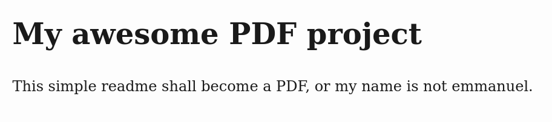
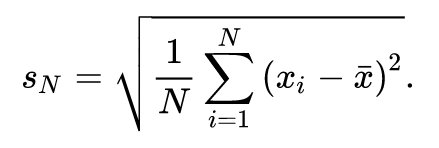

Do you, like me, hate WYSIWYG document editors like Word, Page, or LibreOffice Writer?

Are you more of a markdown person?  
Do you like text-based projects?
Being a linux hardcore freak, or a wanabee linux hardcore freak, are you unafraid of the command line?

Well I've got just the workflow for you :

1. Write in markdown
2. Generate a PDF with some black magic
3. Profit

Let's go together in this, in a pretty drunken and self-deprecating mindset, or it's not fun.

## Write in markdown

Start a new project, init a git repository, shoot a markdown-written readme.

    mkdir my_awesome_pdf_project
    cd my_awesome_pdf_project
    git init
    touch README.md

Write in `README.md`:

```markdown
# My awesome PDF project

This simple readme shall become a PDF, or my name is not
```

And then customize it with your name:

    echo "$USER." >> README.md

Don't forget the initial commit, or it won't be a real linux hardcore freak project:

    git add .
    git commit -m "here be dragons"

## Install Pandoc and play around

[Pandoc](https://pandoc.org/) is a crazy swiss-army knife haskell-written library
that converts just any markup-formatted document into another markup-formatted document.
Pandoc converts html into json, man pages into html, epubs into docx, csv into dokuwiki,
aaaaannnd markdown into PDF !

Install pandoc using your favorite package manager,
on [ubuntu or anything debian-based](https://zoomadmin.com/HowToInstall/UbuntuPackage/pandoc),
on arch linux with the `pandoc` package,
on [macOS](https://pandoc.org/installing.html#macos) if you're brave,
and some legend even tells you can install it [on windows](https://pandoc.org/installing.html#windows).

But that was the easy part.  
Feel free to play around with pandoc, for instance by doing

```sh
pandoc README.md -o README.html --standalone
```

Don't mind the text warnings. Open the html file

    firefox README.html

or if you will

    chrome README.html

or safari, or chromium. You get the idea.



What happened is,
pandoc used its preset html template to generate a standalone html document with decent meta and CSS,
went through `README.md`,
converted markdown `#` markup into `<h1>` markups and so on, and _voilà_!

That's pretty neat, but how about actual PDFs?

## Install LaTeX and enter the real cult

If you thing this whole markdown-to-html stuff was easy and you wish for some more serious headache,
you're about to be served.

Enter LaTeX, one of the oldest peaces of software still in used today.
LaTeX started a bit like the GNU project.
Some nitpicking bloke with too many free time on his hands and a lot of brain cells to burn
decided that his book were not properly typeset.
Yes, a guy actually complained about spacing between letters, margins around text,
that kind of thing ordinary folks never worry about.
So [Donald](https://www.wikiwand.com/en/Donald_Knuth) (yes, that's his name, Donald Knuth)
did what every (in)sane computer freak does:
he went on to invent his own thing to solve his problem.

His typesetting system is called `TeX`, pronounced "tek", and went on to be wrapped and renamed
and repackaged in an obscure way only encyclopedias and annoying know-it-alls understand.
What we talk about now is `LaTeX`, but you've gotta pronounce it "latek" or you can't be part of the gang.

LaTeX is the king of markup languages,
theoretically it is even turing-compatible, with `if` statements and whatnot.
LaTeX is the assembly of document composing.
It is the language of the gods.

One example. This latex-written formula:

```tex
s_N = \sqrt{\frac{1}{N} \sum_{i=1}^N \left(x_i - \bar{x}\right)^2}.
```

becomes



You can't really beat that.

We will need LaTeX.
There's no way around that if we want to brag in the classroom and impress… no one actually. No one will care. But let's do it anyway.

### Installing LaTeX, or how to download way too heavy packages

There's no easy way around this.
Tex and LaTeX are _heavy_.

    sudo pacman -S texlive-most

[ubuntu instructions](https://fahim-sikder.github.io/post/installing-texlive-latest-ubuntu/)

Chances are,
those command won't work and you'll end up searching the internet like a lost soul,
deseperate for a way to understand how any of this is supposed to work.
As a rule of thumb, install anything that ends with `ex`, be it `pdflatex` or `xelatex` or `texlive` and so on.
You should get around 5 GB of packages to install.  
Yes.  
I told you we're in the freak zone.
