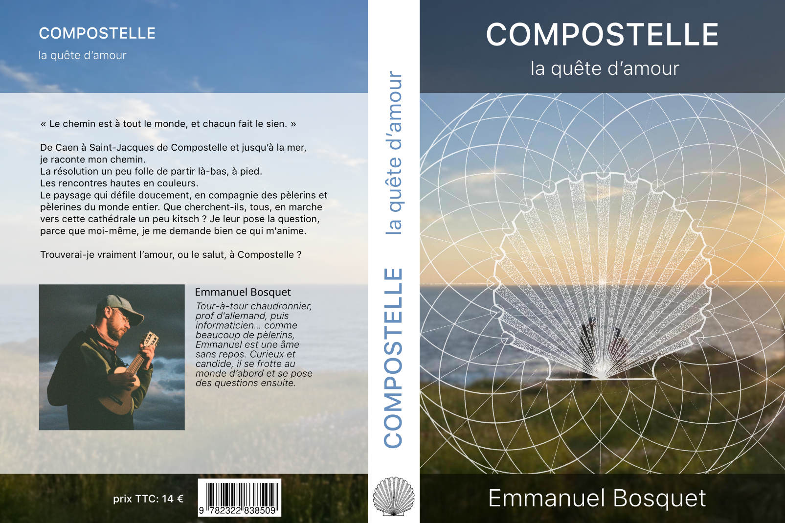

Trop génial, j'ai écrit un livre sur mon chemin de Compostelle !



Ce périple est parti de l'idée un peu débile que j'allais trouver l'amour au bout du chemin,
à Saint-Jacques de Compostelle.
Comme un héros de shōnen un peu borné, je me suis lancé de chez moi à Caen,
et j'y ai cru jusqu'au bout.

Au cours des chapitres,
vous découvrirez les rencontres insolites qui m'ont poussé à faire le chemin,
puis le départ, d'abord modeste, au travers de la Normandie.
Ensuite, par Tours et Bordeaux et la forêt des Landes,
les chemins de Compostelle seront de plus en plus fréquentés,
jusqu'à Saint-Jean-Pied-de-Port.
Là, le trajet devient un énorme camp de vacances international.
Bandes d'amis, *crush* en tous genre, solitude, espoirs, déceptions, pieds douloureux, tout y passe.
Plus ça avance, plus le chemin m'épluche émotionnellement.
À la fin, il ne reste plus grand-chose d'Emmanuel, hormis l'essentiel,
le petit garçon aux yeux grand ouverts sur le monde (et qui pleure tout le temps, mais bon).

En plus des péripéties propres au chemin,
j'ai intercalé des notes culturelles et critiques sur l'histoire du chemin.
C'est fou ce qu'on écrivait comme propagande au Moyen Âge !
J'aborde aussi des questions cruciales, comme le problème des ronfleurs d'auberges,
ou encore : *qu'est-ce qu'un vrai pèlerin ?* (on cherche encore).

Pour le lire, vous pouvez le **commander dans votre librairie préférée** en fournissant ces informations:

```
auteur: Emmanuel Bosquet
titre: Compostelle, la quête d'amour
```

Titre et auteur sont suffisants pour les libraires, mais pour être complet :

```
éditions: Books on Demand
distributeur: SODIS
ISBN: 978-2-322-83850-9
```

350 pages A5 pour 14 €, vous en aurez pour votre argent.
J'ai soigné la mise page,
vous pouvez en [voir un extrait ici](https://www.bod.fr/booksample?id=6486040&referrer=shop).
C'est compilé avec LaTeX 🙂.


Si vous n'aimez pas les librairies physiques,
[vous pouvez le commander en ligne en cliquant ici](https://librairie.bod.fr/compostelle-la-quete-damour-bosquet-emmanuel-9782322838509),
mais vous paierez vous-même les frais de port, c'est dommage.

Un extrait du livre pour vous faire une idée:

> Saint-Jean-Pied-de-Port, c’est le rendez-vous des mystiques
> modernes. Un peu comme Rishikesh, la ville sainte sur le Gange où les
> Beatles ont fait leur retraite de méditation, Saint-Jean-Pied-de-Port est
> une émulsion improbable de ruralité et de mysticisme. Ville de montagnards,
> elle n’aspirait qu’à la tranquillité, mais a été inexplicablement
> prise d’assaut par des Occidentaux en quête d’absolu, leurs yeux fixés
> sur un objectif spirituel qui les dépasse.
>
> Après la légendaire porte Saint-Jacques, j’arrive en haut de la légendaire rue de la Citadelle,
> pour y trouver le numéro 39, le légendaire
> accueil des pèlerins. Une porte ronde en pierre, une balance pour peser
> les sacs (le mien fait 13 kg ! C’est trop), des gentils bénévoles qui font
> l’accueil, et des écriteaux pour rappeler aux pèlerins de rester patients
> car les bénévoles font ce travail gratuitement.
>
> Il y a une petite file d’attente en cette fin de matinée (l’après-midi,
> elle sera interminable). Devant moi, deux personnes seulement. Shelley
> vient de Dallas, en Illinois, et Chris vient du Michigan. Des Étasuniens ! Génial ! Depuis le temps que je voulais en croiser ! Shelley et
> Chris attendent leur tour pour recevoir leur crédenciale et les bons
> conseils des bénévoles. Ils commencent ici leur marche, tout sourire,
> tout pimpants, avec leurs chaussures neuves et leurs bâtons de marche
> rutilants. Je recroiserai Shelley une seule fois, à la cathédrale de Saint-Jacques. Sentiment indescriptible.
>
> Autre rencontre, qui attend avec moi derrière Chris et Shelley :
> Luna. Étasunienne aussi, à peu près de mon âge, j’ai tout de suite
> un faible pour sa posture naïve dans laquelle je me reconnais. Son
> sourire n’est pas le rictus automatique dont les Étasuniens sont spécialistes. Luna sourit comme les hippies, comme ceux qui ont parcouru
> la Grande Fractale, la mort et la renaissance, et en sont ressortis
> convaincus que nous ne sommes que des facettes du grand Tout,
> l’Unité Cosmique qui se rencontre elle-même par notre diversité. Tout
> un programme.
>
> Les bénévoles donnent à Luna une crédenciale et tamponnent la
> mienne à ma demande. Ils nous donnent aussi un fascicule sur lequel
> je comptais : la liste des auberges officielles jusqu’à Saint-Jacques.